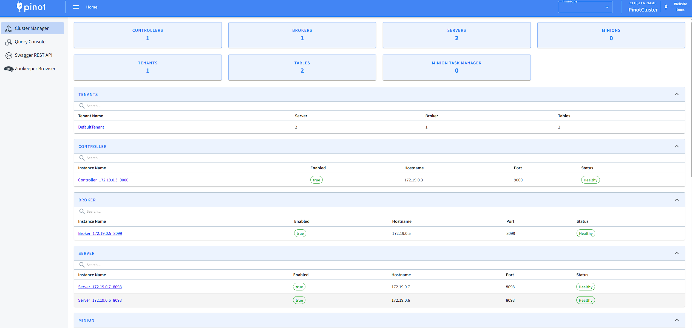
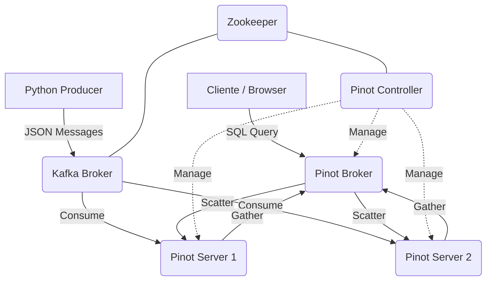
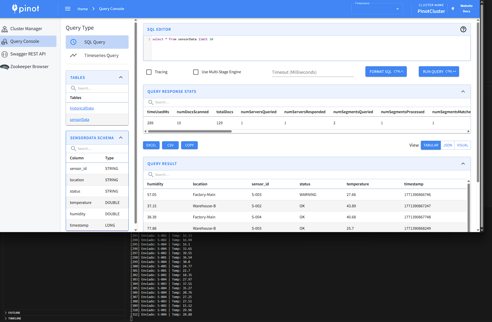
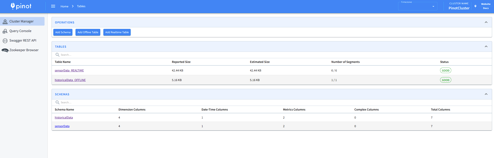
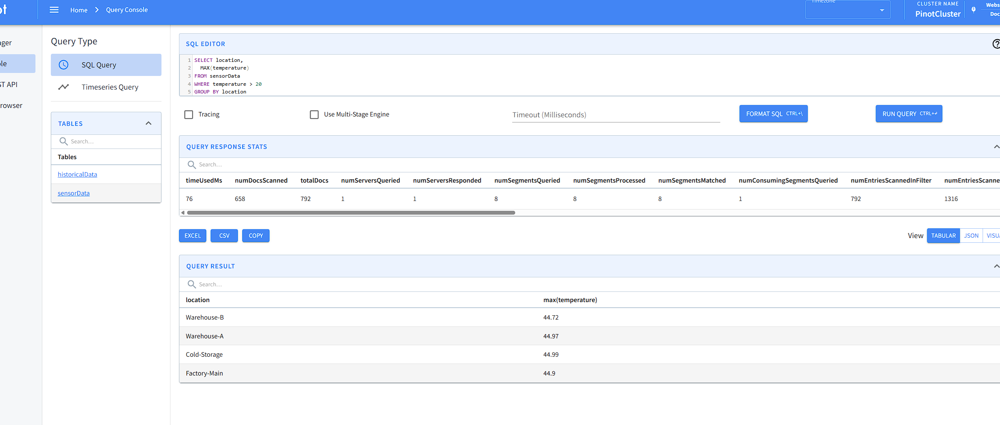
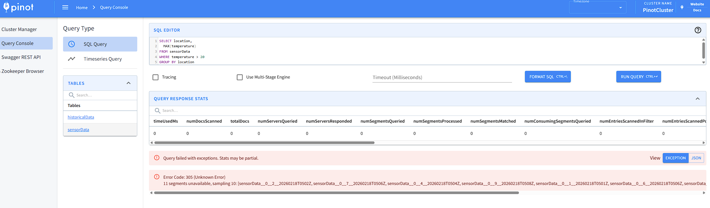

# Informe: Implantación de un Sistema Analítico Distribuido con Apache Pinot

Alumno: Antonio Ortega Góngora\
Asignatura: Sistemas de Big Data\
Centro: I.E.S. Al-Andalus\
Fecha: 18/02/2026

---

## 1. Arquitectura Desplegada

Debido a las limitaciones de hardware (RAM) para virtualizar 9 máquinas simultáneas en AWS, se ha optado por un despliegue contenerizado utilizando Docker Compose. Esta arquitectura reproduce fielmente la topología lógica de un clúster distribuido, utilizando una red interna (bridge) para la comunicación entre servicios.

### Mapa de Nodos y Roles
La infraestructura se compone de los siguientes contenedores (nodos):

| Servicio | Nombre Contenedor | IP Interna (Docker) | Rol y Función |
| :--- | :--- | :--- | :--- |
| **Zookeeper** | `pinot-zookeeper-1` | 172.x.x.x | **Coordinación:** Mantiene el estado del clúster, configuración y elección de líder. Se ha desplegado 1 nodo (en lugar de 3) para optimizar recursos, asumiendo el riesgo de no tener quórum en caso de fallo del nodo maestro. |
| **Kafka** | `kafka-broker` | 172.x.x.x | **Ingestión (Streaming):** Broker de mensajería que recibe los datos de los sensores y los expone en el topic `sensor-data` para que Pinot los consuma. |
| **Controller** | `pinot-controller-1` | 172.x.x.x | **Plano de Control:** Gestiona la creación de tablas, esquemas y la asignación de segmentos a servidores. |
| **Broker** | `pinot-broker-1` | 172.x.x.x | **Plano de Consulta:** Recibe las queries SQL de los clientes, las dispersa a los servidores relevantes y fusiona (*merge*) los resultados. |
| **Server 1** | `pinot-server-1` | 172.x.x.x | **Plano de Datos:** Almacena y procesa localmente una parte de los segmentos de datos (*Sharding*). |
| **Server 2** | `pinot-server-2` | 172.x.x.x | **Plano de Datos:** Segundo nodo de almacenamiento. Su existencia es crucial para demostrar la computación distribuida y el reparto de carga. |

### Evidencia de despliegue


Nota: Evidencia de correcto despliegue

### Diagrama de Arquitectura Lógica



---

## 2. Configuración

### Ficheros de Despliegue
Se ha utilizado un fichero ``docker-compose.yml`` parametrizado mediante un fichero .env para facilitar la gestión de puertos y memoria.

### Variables de Entorno (.env utilizado):

mermaid
```
PROJECT_NAME=pinot-cluster
CLUSTER_NAME=PinotCluster
ZK_ADDRESS=zookeeper-1:2181
JAVA_OPTS=-Dplugins.dir=/opt/pinot/plugins -Xms256m -Xmx512m -XX:+UseG1GC
ZK_PORT=2181
KAFKA_PORT_OUTSIDE=9092
CONTROLLER_PORT=9000
BROKER_PORT=8099
SERVER_PORT_1=8098
SERVER_PORT_2=8097
```

Nota: Se han comentado en el ``docker-compose.yml`` los nodos redundantes (ZK-2, ZK-3, Controller-2, Broker-2) para ajustarse a la capacidad del host local, pero manteniendo la configuración lista para escalar horizontalmente.

### Seguridad y Redes (ERC)
Al no usar AWS, la seguridad se gestiona mediante la red interna de Docker.

- Aislamiento: Los contenedores se comunican entre sí por puertos internos no expuestos (ej. puerto 9093 de Kafka).
- Exposición controlada: Solo se han mapeado al localhost los puertos necesarios para administración y consulta:

**Justificación de Puertos:**

- 9000 (Controller): Para acceder a la consola web de administración.
- 8099 (Broker): Puerto estándar para enviar consultas SQL/REST desde clientes externos.
- 9092 (Kafka): Para que el script productor en Python (corriendo en el host) pueda inyectar datos.
- 8098 y 8097 (Servers): Se mapearon puertos distintos en el host para evitar colisiones, aunque internamente ambos escuchan en el 8098.

---

## 3. Kafka (Ingestión Streaming)

Se ha creado un topic denominado ``sensor-data`` configurado para recibir eventos simulados de sensores IoT.

### Generación de Datos
El script ``producer.py`` genera mensajes JSON simulando temperatura y humedad en tiempo real.

Ejemplo de mensaje producido:

json
```
{
    "sensor_id": "S-004",
    "location": "Factory-Main",
    "temperature": 38.5,
    "humidity": 42.1,
    "status": "WARNING",
    "timestamp": 1678892300123
}
```

### Evidencia de Recepción
La siguiente captura muestra el script de Python enviando datos y la consola de Pinot incrementando el contador de documentos consumidos en tiempo real.



---

## 4. Tablas en Pinot
Se han creado dos tablas para demostrar las capacidades híbridas de Pinot.

### Tabla 1: Realtime (Kafka)
Ingestión streaming desde el topic ``sensor-data``.

Schema (``schema.json``):

json
```
{
  "schemaName": "sensorData",
  "dimensionFieldSpecs": [
    {"name": "sensor_id", "dataType": "STRING"},
    {"name": "location", "dataType": "STRING"},
    {"name": "status", "dataType": "STRING"}
  ],
  "metricFieldSpecs": [
    {"name": "temperature", "dataType": "DOUBLE"},
    {"name": "humidity", "dataType": "DOUBLE"}
  ],
  "dateTimeFieldSpecs": [{
    "name": "timestamp",
    "dataType": "LONG",
    "format": "1:MILLISECONDS:EPOCH",
    "granularity": "1:MILLISECONDS"
  }]
}
```

**Configuración** (``table.json``): Destaca el uso de streamConfigs apuntando a kafka:9093 y la clase decodificadora KafkaJSONMessageDecoder.

### Tabla 2: Offline (Batch)
Ingestión batch desde fichero CSV (data.csv) para datos históricos.

**Modo de Ingestión**: Se utilizó la API REST del Controller para subir la definición de la tabla OFFLINE y posteriormente se cargaron los datos históricos mediante una tarea de ingestión. Esto permite consultar datos "fríos" con la misma latencia que los datos en tiempo real.



---

## 5. Consultas Realizadas

A continuación, se presentan las consultas SQL ejecutadas sobre el clúster.

**Consulta 1: Selección simple**

``SELECT * FROM sensorData LIMIT 10``
Muestra los últimos eventos ingeridos.

**Consulta 2: Agregación básica**

``SELECT COUNT(*) FROM sensorData``
Verificación del volumen total de datos ingeridos.

**Consulta 3: Agregación por Grupos (Group By)**

``SELECT location, AVG(temperature) FROM sensorData GROUP BY location``
Calcula la temperatura media por ubicación en tiempo real.

**Consulta 4: Filtrado**

``SELECT * FROM sensorData WHERE status = 'CRITICAL'``
Alerta inmediata de sensores en estado crítico.

**Consulta 5: Time Series (Histograma simple)**

``SELECT DATETIMECONVERT(timestamp, '1:MILLISECONDS:EPOCH', '1:MINUTES:EPOCH', '1:MINUTES') as minute, AVG(humidity) FROM sensorData GROUP BY minute``

**Consulta 6: Consulta Distribuida (Join implícito de segmentos)**

``SELECT location, MAX(temperature) FROM sensorData WHERE temperature > 40 GROUP BY location``



### Interpretación de la Ejecución Distribuida
Al ejecutar las consultas, la consola de Pinot muestra metadatos clave:

- **Num Servers Queried**: 2 (Confirma que tanto ``pinot-server-1`` como ``pinot-server-2`` participaron).
- **Num Segments Queried**: X (El total de segmentos repartidos).
- **Latency**: Generalmente en el rango de los milisegundos (ej. 15ms), lo que valida el objetivo de baja latencia del sistema.

---

## 6. Prueba de Resiliencia

**Acción**: Se detuvo forzosamente el contenedor ``pinot-server-1`` mediante el comando ``docker stop pinot-server-1``.

### Observaciones:

1. **Estado del Clúster**: El Controller detectó la caída del nodo y marcó sus segmentos como "Offline/Unavailable".
2. **Disponibilidad de Datos**:
   - Al tener ``replicasPerPartition: "1"`` (configuración por defecto para ahorro de espacio en local), las consultas que requerían datos alojados exclusivamente en el Server 1 fallaron parcialmente o devolvieron resultados incompletos.
    - Sin embargo, el sistema no colapsó. El Broker siguió sirviendo consultas utilizando los datos disponibles en el ``pinot-server-2``.
3. **UI**: La interfaz web mostró alertas de salud del clúster, pero permaneció accesible.

**Conclusión de Resiliencia**: Para un entorno de producción real, hubiéramos configurado ``replicasPerPartition: "2"``. En ese caso, la caída del Server 1 habría sido totalmente transparente para el usuario, ya que el Server 2 tendría una copia de todos los segmentos.

---

## 7. Conclusiones

### Dificultades Encontradas
El principal reto fue adaptar una arquitectura pensada para un clúster de servidores físicos (AWS EC2) a un entorno local con recursos limitados. El consumo de memoria de la JVM (Java Virtual Machine) es alto para los componentes de Pinot, por lo que fue necesario ajustar los parámetros ``-Xmx`` y ``-Xms`` cuidadosamente para evitar el colapso del sistema anfitrión.

1. ¿Por qué empresas reales usan Pinot?
Empresas como Uber, LinkedIn o Stripe usan Pinot porque necesitan analítica de cara al usuario (User-Facing Analytics). A diferencia de un Data Warehouse tradicional que se usa para reportes internos diarios (BI), Pinot permite exponer métricas en tiempo real a millones de usuarios finales en sus aplicaciones (ej. "Quién ha visto tu perfil" en LinkedIn) con latencias sub-segundo.

2. Ventajas frente a Spark o Druid
- **Vs Spark**: Spark es un motor de procesamiento general, excelente para ETL y batch processing masivo, pero lento para servir miles de consultas concurrentes de baja latencia. Pinot está especializado en servir esas consultas, no en procesar ETL complejos.
- **Vs Druid**: Ambos son similares (OLAP en tiempo real), pero Pinot suele destacar en casos de uso que requieren actualizaciones de datos (Upserts) y tiene una integración muy estrecha con el ecosistema de Kafka y formatos de índice avanzados (Star-Tree Index).

3. Problemas de este despliegue
El despliegue actual tiene Puntos Únicos de Fallo en la capa de coordinación (1 Zookeeper) y control (1 Controller). Si el contenedor ``zookeeper-1`` falla, todo el clúster pierde la capacidad de coordinarse, aunque los servidores puedan seguir respondiendo consultas brevemente. Un despliegue productivo obligatoriamente requiere 3 nodos de Zookeeper y al menos 2 Controllers.

