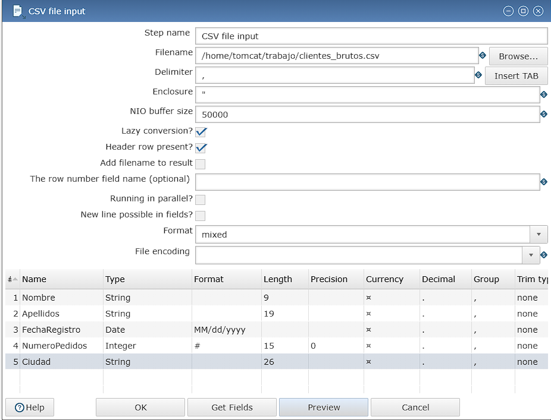
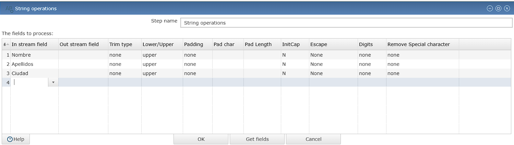
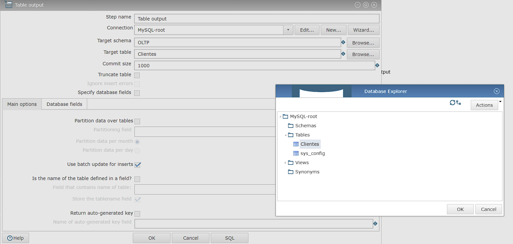

# Memoria del Proceso ETL con Pentaho Data Integration

**Autor:** Antonio Ortega Góngora   
**Asignatura:** Sistemas de Big Data   
**Práctica:** Práctica ETL de datos mediante Pentaho

---

## 1. Introducción
El objetivo de esta práctica ha sido diseñar e implementar un proceso de extracción, transformación y carga (ETL) utilizando **Pentaho Data Integration (PDI)** ejecutado sobre una arquitectura de contenedores **Docker**.

El flujo procesa un fichero de datos brutos (`clientes_brutos.csv`) que contiene información de clientes con inconsistencias, realiza una limpieza y estandarización de los datos, y finalmente bifurca la salida hacia dos destinos: una base de datos **MySQL** para los registros válidos y ficheros CSV para auditoría (registros limpios y rechazados).

---

## 2. Descripción del Flujo y Pasos Utilizados

Para realizar la tarea, se ha diseñado una transformación (`.ktr`) que sigue la lógica secuencial descrita a continuación.

*Captura del flujo seguido*

### Detalle de los Pasos:

1.  **CSV File Input (Entrada):**
    * **Función:** Lectura del fichero `clientes_brutos.csv`.
    * **Configuración:** Se definieron los tipos de datos iniciales, prestando especial atención al campo `NumeroPedidos` (Integer) y `FechaRegistro` (Date con formato `MM/dd/yyyy`).

2.  **Filter Rows (Filtrado de Calidad):**
    * **Función:** Separar los datos válidos de los erróneos.
    * **Lógica:** Se estableció una condición para detectar registros con campos críticos vacíos (nulos). Si `Nombre` O `Apellidos` son nulos, el flujo se desvía al camino de "Rechazados". Si están completos, continúan hacia la transformación.

3.  **String Operations (Transformación):**
    * **Función:** Estandarización de cadenas de texto.
    * **Acción:** Se aplicó la función `Upper Case` a los campos `Nombre`, `Apellidos` y `Ciudad` para normalizar toda la información a mayúsculas, facilitando futuras búsquedas en base de datos.

4.  **Value Mapper / Calculator (Opcional - Lógica de Negocio):**
    * **Función:** En caso de necesitar limpiar espacios en blanco o realizar cálculos derivados sobre el número de pedidos.

5.  **Table Output (Carga en Base de Datos):**
    * **Función:** Inserción de los datos limpios en la tabla `Clientes` de MySQL.
    * **Configuración:** Se utilizó la conexión JDBC (`mysql-connector-j`) y se realizó el mapeo explícito de campos (ej. `FechaRegistro` -> `fecha_registro`) para asegurar la integridad del esquema.

6.  **Text File Output (Salida de Ficheros):**
    * **Salida 1 (`clientes_limpios.csv`):** Guarda una copia de respaldo de los datos que superaron los filtros y transformaciones.
    * **Salida 2 (`clientes_rechazados.csv`):** Almacena las filas descartadas por el paso de filtrado, permitiendo una posterior auditoría manual.

---

## 3. Errores Detectados en los Datos

Durante el análisis del fichero origen `clientes_brutos.csv`, se identificaron y gestionaron los siguientes problemas de calidad de datos:

* **Valores Nulos (Missing Values):** Se detectaron múltiples registros donde el `Nombre` o el `Apellido` estaban ausentes. Estos registros violan las reglas de integridad para un cliente, por lo que fueron segregados al fichero de rechazados.
* **Formatos de Fecha Inconsistentes:** El fichero original presentaba fechas en formato americano (Mes/Día/Año), lo cual difiere del estándar habitual en España y bases de datos (Día/Mes/Año o Año-Mes-Día).
* **Tipos de Datos en Pedidos:** Algunos registros en el campo `NumeroPedidos` contenían espacios en blanco o caracteres no numéricos que podrían causar fallos de inserción. Al forzar el tipo `Integer` en la entrada, Pentaho gestionó estos casos convirtiéndolos a `NULL` o rechazando la fila según la configuración estricta.

---

## 4. Gestión y Conversión de Fechas

Uno de los retos principales fue la correcta interpretación de la fecha de registro.

* **Problema:** El CSV origen trae la fecha como `05/17/2022` (17 de Mayo). Si se lee como texto o con formato europeo por defecto, el sistema intentaría interpretar el "17" como el mes, provocando un error.
* **Solución Implementada:**
    1.  En el paso **CSV File Input**, se configuró explícitamente el formato de lectura de la columna `FechaRegistro` como `MM/dd/yyyy`. Esto permitió a Pentaho entender correctamente que los primeros dígitos corresponden al mes.
    2.  Una vez que Pentaho entiende el dato como un objeto tipo "Date", el formato visual es irrelevante internamente.
    3.  Al volcarlo a **MySQL**, el driver JDBC se encarga automáticamente de convertir ese objeto fecha al formato estándar de base de datos (`YYYY-MM-DD`), garantizando que las consultas SQL posteriores ordenen y filtren cronológicamente sin errores.

---

## 5. Posibilidades de Uso No Exploradas

Pentaho Data Integration es una herramienta robusta. Aunque esta práctica cubre un flujo ETL fundamental, veo gran potencial en las siguientes funcionalidades avanzadas para un entorno empresarial real:

1.  **Automatización y Orquestación (Jobs):**
    * Actualmente ejecutamos la transformación manualmente (`.ktr`). Sería ideal encapsularla en un "Job" (`.kjb`) que verifique primero si el fichero existe, envíe un correo electrónico de éxito/fracaso al administrador y mueva el fichero procesado a una carpeta de "histórico".

2.  **Uso de Variables y Parámetros:**
    * Para no tener rutas "hardcodeadas" (fijas), se podrían usar variables de entorno (ej. `${INPUT_DIR}`, `${DB_HOST}`) en el archivo `pentaho.properties`. Esto haría el despliegue en diferentes entornos (Desarrollo, Test, Producción) mucho más ágil.

3.  **Integración con APIs:**
    * En lugar de leer un CSV estático, Pentaho podría conectarse mediante pasos **REST Client** o **HTTP Client** a un CRM (como Salesforce o HubSpot) para extraer los clientes en tiempo real.

4.  **Gestión de Errores Avanzada:**
    * Implementar pasos de "Error Handling" en la salida a Base de Datos para que, si falla una inserción específica (por ejemplo, un duplicado de clave primaria), no se detenga todo el proceso, sino que esa fila específica vaya a un fichero de errores de base de datos.

## Screenshots -

*Configuración del nodo CSV File Input*

*Configuración del nodo de filtrado de filas(segunda clausula)*

*Configuración del string operations*

*Configuración de la conexión de la database*

*Selección de la tabla creada en MySQL*
